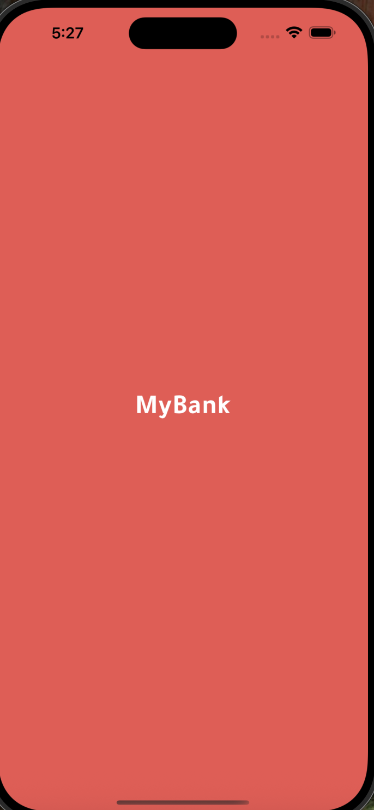
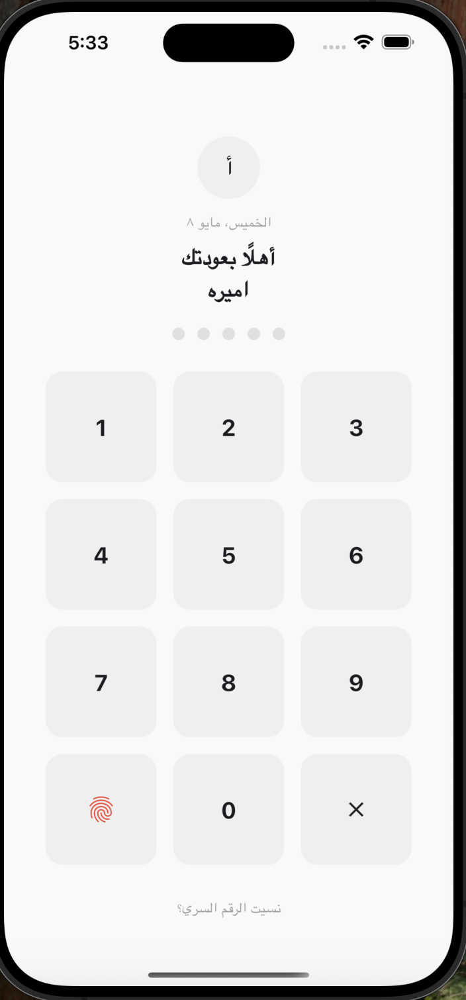
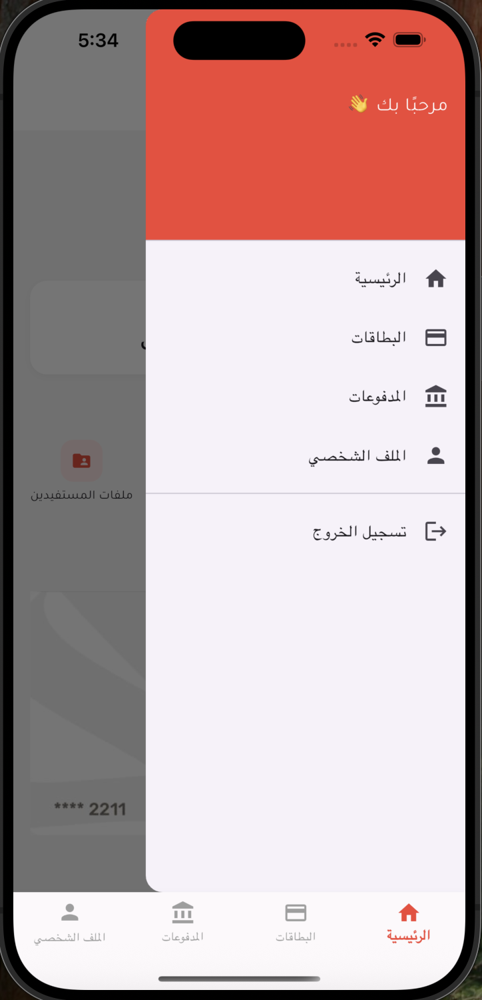
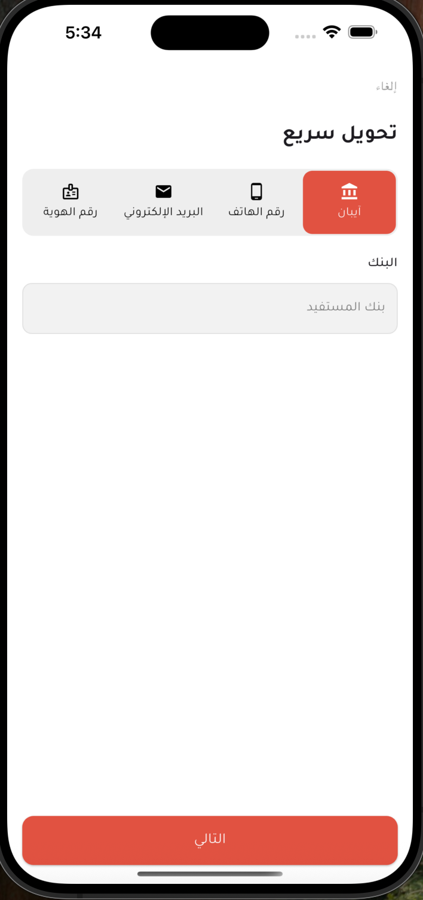
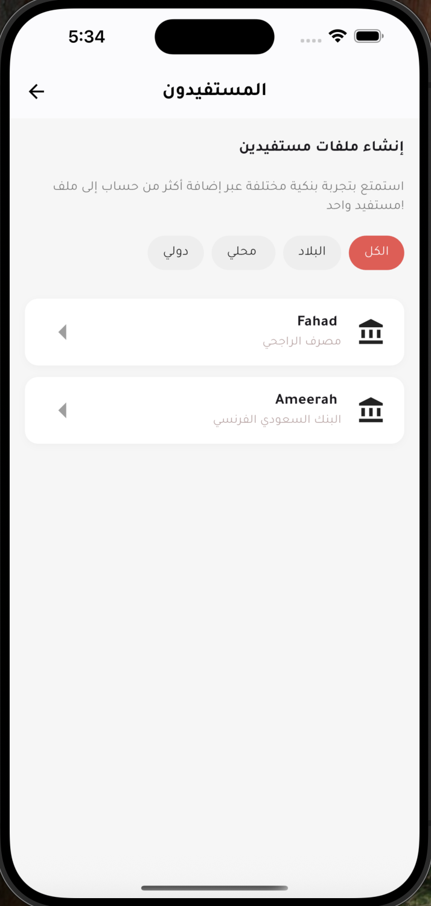
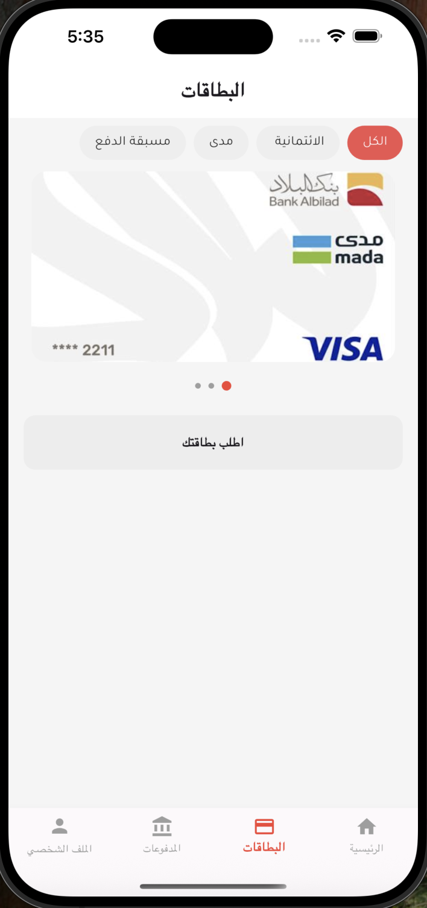
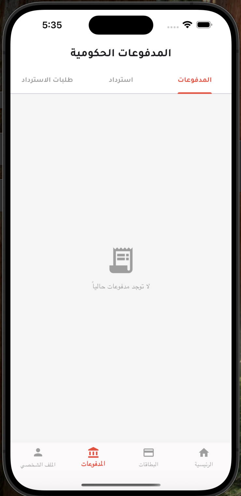
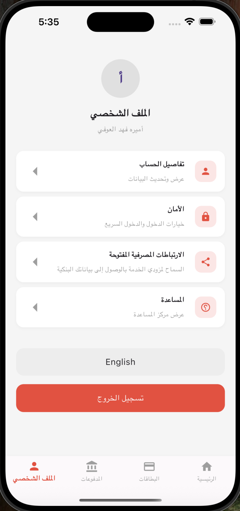
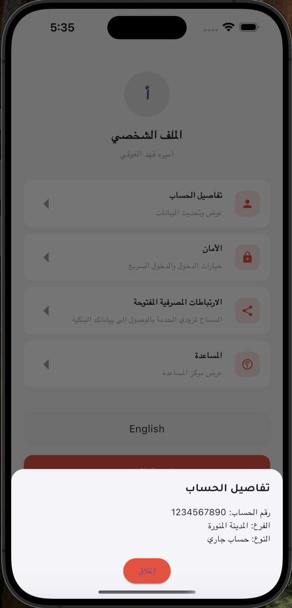
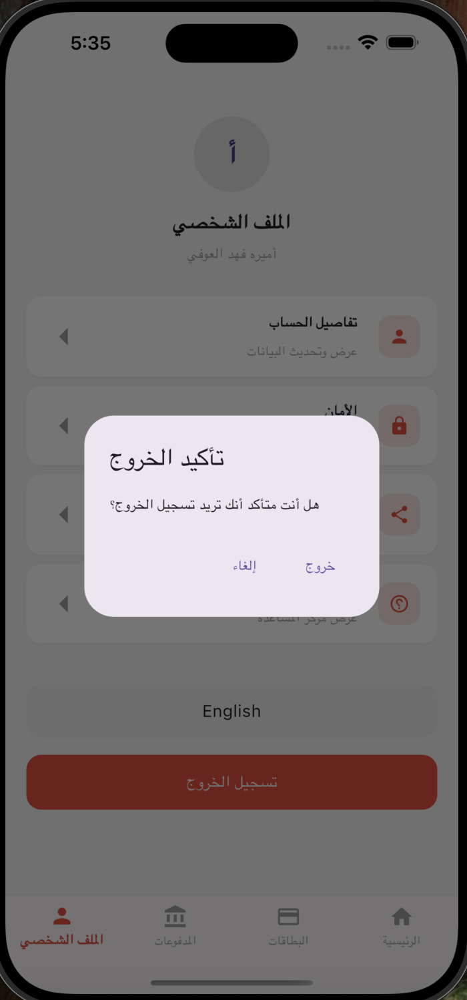

# 📱 My Bank App 

## 📝 Overview
My Bank is a sleek and modern banking application built with Flutter. It simulates a real mobile banking experience by providing interactive UIs, smooth navigation, and essential banking features. This project showcases various Flutter concepts including state management, routing, and UI design with a focus on user experience.

---

## 🎯 Features Implemented

| Feature                    | Description                                                                 |
|---------------------------|-----------------------------------------------------------------------------|
| 🧭 Drawer Widget          | Navigation drawer to access major app sections                             |
| ⚠️ AlertDialog            | Confirmation dialog for logout                                              |
| 🔤 TextFields             | Used for input (e.g., Quick Transfer screen)                                |
| 🔁 Navigation             | Named route navigation across multiple screens                              |
| 📂 BottomNavigationBar    | Switch between Home, Cards, Payments, and Profile                          |
| 📦 External Packages      | `google_fonts` for typography and `shimmer` for loading placeholders        |
| ✨ Shimmer Effect         | Loading effect for the cards slider in Cards screen                         |
| 🚀 Splash Screen          | Splash screen shown on app startup                                          |
| 📥 Bottom Sheet           | Bottom sheet added in Profile screen for additional options                 |
| 🗂️ TabBarView + TabBar   | Organized Payment section into tabs (e.g., Payments, Refunds, Requests)     |
| 📄 PageView               | Used in CardsScreen to show card slider                                     |

---
## 📸 Screenshots

| Splash | PIN Login | Home |
|--------|-----------|------|
|  |  |  |

| Drawer | Quick Transfer | Beneficiaries |
|--------|----------------|----------------|
|  |  |  |

| Cards | Payments-TapView | Profile |
|----------|----------|---------|
|  |  |  |

| Bottom Sheet | AlertDialog |
|--------|--------------|
|  |  |

---

## 🚀 How to Run
1. Clone the repo:
   ```bash
   git clone https://github.com/Ameerah077/App-Design-Implementation.git
   ```
2. Navigate to the project folder:
   ```bash
   cd my-bank-app
   ```
3. Get dependencies:
   ```bash
   flutter pub get
   ```
4. Run the app:
   ```bash
   flutter run
   ```

---

## 🧱 Widgets & Packages Used

### Key Widgets:
- `Scaffold`, `Drawer`, `AppBar`, `BottomNavigationBar`, `ListView`, `PageView`
- `AlertDialog`, `TabBar`, `TabBarView`, `TextField`, `GridView`, `DropdownButton`

### External Packages:
- [google_fonts](https://pub.dev/packages/google_fonts)
- [shimmer](https://pub.dev/packages/shimmer)

---

## 💡 Notes
- The app is fully RTL supported.
- Modular code using widget breakdown for reusability and readability.
- Designed to be mobile-friendly with responsive layouts and consistent styling.

---

## 👩‍🎓 Author
Ameerah  Aloufi